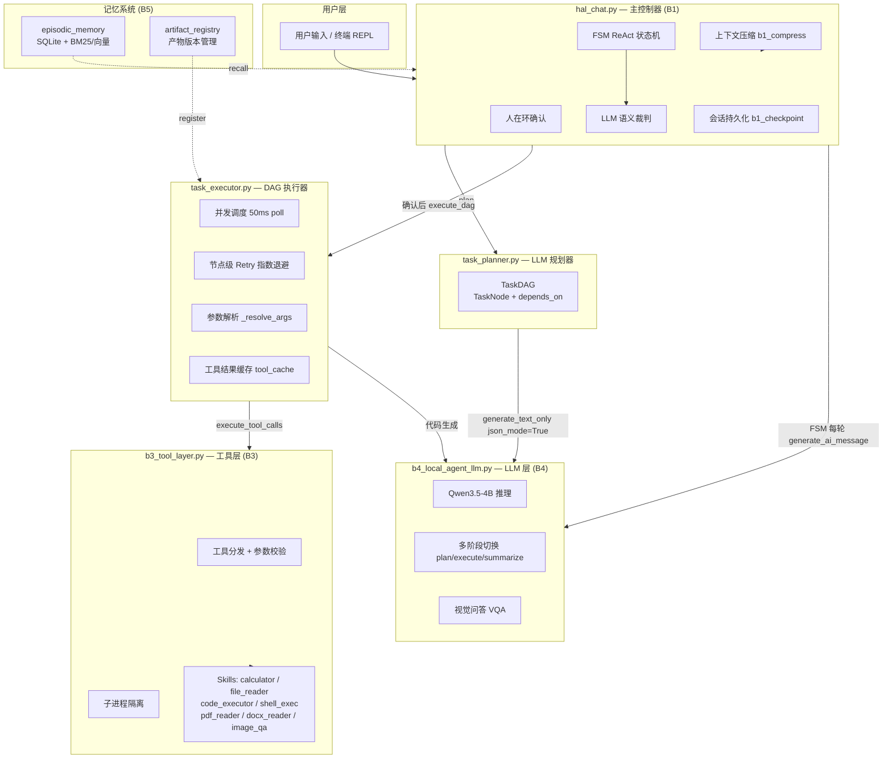

# HAL1000 — 本地 Agent 框架（综合实训 B 方向）

> 基于 Qwen3.5-4B 的完全本地 Agent 系统，不依赖任何云 API。
> 实现 DAG 并发调度、FSM ReAct 状态机、LLM 语义裁判、分层记忆、会话持久化等核心能力。

---

## 1. 项目概述

### 1.1 项目名称

`HAL1000 Agent Framework`

### 1.2 项目目标

面向**本地长程任务执行**场景：给定用户自然语言指令，系统自动规划任务图（DAG）、并发调度工具调用、裁判执行结果、管理上下文记忆，最终给出完整回答。

核心能力：

- **B1 运行时**：DAG 并发调度 + FSM ReAct 双路径 + LLM 语义裁判 + 分层记忆 + 会话持久化
- **B2 技能层**：5 个基础 Skill + 复合 Skill + 沙箱代码执行
- **B3 工具层**：自动 schema 生成 + 工具调用分发 + Retry / Cache / Stats
- **B4 LLM 层**：本地 Qwen3.5-4B 推理 + 多阶段模型切换 + 视觉问答
- **B5 记忆层**：Episodic Memory（SQLite + BM25 / 向量检索）+ 产物版本管理

### 1.3 当前完成情况

| 类型 | 完成情况 |
|---|---|
| B1 基础要求 | ✅ 全部完成 |
| B2 基础要求 | ✅ 全部完成（5 个 Skill） |
| B3 基础要求 | ✅ 全部完成（schema 生成 + 工具调用执行） |
| B4 基础要求 | ✅ 全部完成（prompt_json 模式真实推理） |
| B5 基础要求 | ✅ 全部完成（记忆存取 + 索引） |
| B1 进阶 | ✅ DAG 并发调度、FSM 裁判、会话持久化、分层记忆、产物管理 |
| B2 进阶 | ✅ 复合 Skill、沙箱执行、ErrorCode 分类 |
| B3 进阶 | ✅ auto_schema、Retry、Cache、Stats、schema ablation 实验 |
| B4 进阶 | ✅ 多阶段模型切换、视觉 VQA、json_mode 生成控制 |
| 当前限制 | 沙箱非完全隔离；tool_cache 无 TTL；裁判每次额外消耗 ~1-2s 推理 |

---

## 2. 整体流程与模块结构

### 2.1 模块边界

| 模块 / 阶段 | 入口文件 | 主要职责 | 输入 | 输出 |
|---|---|---|---|---|
| **主控 REPL** | `code/hal_chat.py` | 多轮对话循环、DAG/FSM 路径切换、人在环确认 | 用户自然语言 | 最终回答（终端打印） |
| **任务规划器** | `code/task_planner.py` | LLM 生成 JSON DAG | 用户输入 + 历史 | TaskDAG 数据结构 |
| **DAG 执行器** | `code/task_executor.py` | 并发调度工具调用、节点 Retry、参数解析 | TaskDAG | 各节点 SkillResult + 汇总文本 |
| **B2 技能层** | `skills/*.py` | 具体工具实现（读写文件、计算、执行代码等） | 参数 JSON | SkillResult JSON |
| **B3 工具层** | `code/b3_tool_layer.py` | Schema 生成、工具分发、参数校验、子进程隔离 | AIMessage tool_calls | ToolMessage 数组 |
| **B4 LLM 层** | `code/b4_local_agent_llm.py` | 本地模型推理、多阶段切换、视觉问答 | messages 列表 | AIMessage（含 tool_calls 或 final answer） |
| **B5 记忆层** | `code/episodic_memory.py` | Episodic Memory 存取、BM25/向量检索 | 轮次文本 | Top-K 召回结果 |
| **产物管理** | `code/artifact_registry.py` | 工具产物版本化、rollback、diff | 工具 output | 带版本号的 Artifact 引用 |
| **上下文压缩** | `code/b1_compress.py` | 超过阈值时自动压缩历史消息 | messages 列表 | 压缩后 messages |
| **会话持久化** | `code/b1_checkpoint.py` + `code/b1_resume.py` | 保存/恢复 session（`--resume`） | session JSON | 恢复的 messages + artifacts |

### 2.2 系统架构图



### 2.3 一次完整任务的流程

以「写一个贪吃蛇游戏」为例：

1. **用户输入** → `hal_chat.py` 接收，发送给 `task_planner.py`
2. **规划阶段**：`task_planner` 调用 `generate_text_only(json_mode=True)`，Qwen3.5-4B 输出 JSON DAG（如：`t1 code_executor → t2 file_writer → t3 code_executor 验证`）
3. **人在环确认**：终端显示任务计划，用户回车确认 / 输入修改意见 / 输入 `n` 取消
4. **DAG 执行**：`task_executor` 并发调度 ready 节点，`__GENERATE__` 占位符触发 LLM 代码生成
5. **工具调用**：`b3_tool_layer` 执行 `code_executor`（子进程隔离），返回 SkillResult
6. **产物注册**：`artifact_registry` 记录生成的文件路径和版本
7. **Summarize**：DAG 全部完成后，LLM 汇总所有节点结果生成最终回答
8. **裁判验证**：`_judge_by_llm` 判断回答是否满足需求；不满足则注入 nudge 进入 FSM 补充
9. **记忆归档**：本轮对话写入 `episodic_memory`，供后续召回

---

## 3. 模型、数据集与外部资源

### 3.1 模型说明

| 项目 | 内容 |
|---|---|
| 主推理模型 | `Qwen3.5-4B` |
| 模型来源 | [ModelScope](https://www.modelscope.cn/models/Qwen/Qwen3.5-4B) |
| 服务器路径 | `/root/siton-tmp/HAL1000/Qwen3.5-4B` |
| 项目内配置 | `configs/model.yaml`（`${HAL_MODEL_PATH:-../Qwen3.5-4B}`） |
| 是否需要 GPU | 推荐（bfloat16 约 10 GB 显存）；CPU 可跑但慢 30-90s/次 |
| 是否需要联网 | 否（`local_files_only: true`） |
| 嵌入模型（可选） | `all-MiniLM-L6-V2`（向量检索，fallback 到 BM25） |
| 嵌入模型路径 | `code/models/all-MiniLM-L6-V2/` |

```bash
# 本地使用时，设置环境变量指向模型路径
export HAL_MODEL_PATH=/path/to/Qwen3.5-4B
```

### 3.2 数据集 / 示例数据说明

| 数据或文件 | 用途 | 来源 | 项目内路径 |
|---|---|---|---|
| `data/tool_inputs/tool_input_*.json` | B2 各 Skill 的正常测试输入 | 项目自带 | `data/tool_inputs/` |
| `data/tool_inputs/*_error.json` | B2 各 Skill 的异常测试输入 | 项目自带 | `data/tool_inputs/` |
| `data/tool_inputs/advanced/` | B2 进阶 Skill 测试用例 | 项目自带 | `data/tool_inputs/advanced/` |
| `data/messages/ai_message_with_tool_calls.json` | B3 工具调用执行测试 | 项目自带 | `data/messages/` |
| `data/messages/b3_*.json` | B3 异常场景（未知工具/缺参数） | 项目自带 | `data/messages/` |
| `data/b1_fixtures/` | B1 Agent 运行时 fixture | 项目自带 | `data/b1_fixtures/` |
| `data/gsm8k_500.csv` | 数学推理测试集 | GSM8K 公开数据 | `data/gsm8k_500.csv` |
| `data/GDPRPrivacyNotice.pdf` | PDF 阅读测试文档 | 项目自带 | `data/` |
| `data/IMG_0532.png` | 视觉问答测试图片 | 项目自带 | `data/` |
| `data/科研训练学习总结.docx` | DOCX 阅读测试（中文路径） | 项目自带 | `data/` |
| `memory/conversations/` | B5 历史对话记忆库 | 运行时积累 | `memory/conversations/` |

---

## 4. 环境安装

### 4.1 运行环境

| 项目 | 要求 |
|---|---|
| Python 版本 | 3.10 |
| 操作系统 | Linux（服务器验证）/ macOS / Windows |
| GPU | 推荐 A100 / 3090 / 4090（≥ 10 GB 显存）；CPU 可 debug |
| 主要依赖 | torch、transformers、PyYAML、sentencepiece、pillow |

### 4.2 安装步骤

```bash
# 1. 克隆项目
git clone <repo_url>
cd agent

# 2. 创建并激活 conda 环境
conda create -n hal python=3.10 -y
conda activate hal
export PYTHONNOUSERSITE=1   # 禁止用户级 site-packages 干扰

# 3. 安装依赖（含 CUDA 11.8 torch wheel）
pip install -r requirements.txt

# 4. （本地）配置模型路径
export HAL_MODEL_PATH=/path/to/Qwen3.5-4B
# 或直接修改 configs/model.yaml 里的默认路径

# 5. 验证安装
cd code
python -c "from b4_local_agent_llm import generate_ai_message; print('OK')"
```

**常见问题：**

- `local model path does not exist`：未设置 `HAL_MODEL_PATH` 或模型不在 `../Qwen3.5-4B`，见 `docs/PORTABILITY.md`
- `flash-linear-attention not installed`：正常 warning，框架自动 fallback，不影响运行
- `pad_token_id` warning：正常，已 fallback 到 `eos_token_id`
- GPU 显存不足：在 `configs/model.yaml` 中改 `torch_dtype: float32` 并减小 `max_new_tokens`

---

## 5. 配置文件说明

### 5.1 主要配置文件

| 配置文件 | 作用 | 需要修改的字段 |
|---|---|---|
| `configs/model.yaml` | 模型路径、生成参数、运行模式 | `model_name_or_path`（本地路径） |
| `configs/tools.yaml` | 工具集定义、skill 模块映射、参数 schema | 通常不需要改 |
| `configs/memory.yaml` | 记忆系统配置 | `compress_after`、`keep_recent` |
| `configs/model_roster.yaml` | 多阶段模型切换配置（plan/execute/summarize） | 如需切换不同阶段模型 |

### 5.2 主要输入文件

| 输入文件 | 用途 | 适用场景 |
|---|---|---|
| `data/tool_inputs/tool_input_calculator.json` | 算术计算正常用例 | B2 基础演示 |
| `data/tool_inputs/tool_input_calculator_error.json` | 非法表达式异常用例 | B2 异常处理演示 |
| `data/tool_inputs/tool_input_file_reader.json` | 文件读取正常用例 | B2 基础演示 |
| `data/tool_inputs/advanced/composite_ok.json` | 复合 Skill 正常用例 | B2 进阶演示 |
| `data/tool_inputs/advanced/sandbox_blocked.json` | 沙箱拦截危险代码用例 | B2 沙箱安全演示 |
| `data/messages/ai_message_with_tool_calls.json` | 标准 tool_calls 执行 | B3 基础演示 |
| `data/messages/b3_tool_call_unknown_tool.json` | 未知工具名错误处理 | B3 异常场景 |
| `data/messages/b3_tool_call_missing_required.json` | 缺必填参数错误处理 | B3 异常场景 |
| `data/b1_fixtures/b1_fixture_input.json` | Agent 运行时固定输入 | B1 模块演示 |
| `data/runtime_input.json` | 完整系统运行输入 | 全系统 Demo |

---

## 6. 完整流程 Demo 运行

### 6.1 交互式 Agent（主入口，推荐验收使用）

```bash
cd /root/siton-tmp/HAL1000/agent/code

# 真实模型模式（prompt_json）
python hal_chat.py --mode prompt_json \
    --model_path /root/siton-tmp/HAL1000/Qwen3.5-4B

# 恢复历史会话
python hal_chat.py --mode prompt_json \
    --model_path /root/siton-tmp/HAL1000/Qwen3.5-4B \
    --resume <session_id>

# Mock 模式（无需 GPU，用于快速验证框架）
python hal_chat.py --mode mock
```

也可使用启动脚本：

```bash
bash code/run_hal.sh
```

**验收推荐 Demo 输入（交互式输入）：**

```
# 代码生成
写一个贪吃蛇游戏

# 文档阅读 + 分析
阅读 /root/siton-tmp/HAL1000/agent/B方向_Agent智能体_说明文档.docx，我们的代码是否完成了里面的要求

# 多步任务
读取 /root/siton-tmp/HAL1000/agent/data/GDPRPrivacyNotice.pdf，总结主要条款

# 视觉问答
分析这张图片：/root/siton-tmp/HAL1000/agent/data/IMG_0532.png
```

### 6.2 独立模块演示

```bash
cd /root/siton-tmp/HAL1000/agent/code

# B2 基础 Skill
python b2_run_skill.py --skill calculator \
    --input ../data/tool_inputs/tool_input_calculator.json \
    --outdir ../outputs/B2_skills/calculator_ok

python b2_run_skill.py --skill file_reader \
    --input ../data/tool_inputs/tool_input_file_reader.json \
    --outdir ../outputs/B2_skills/file_reader_ok

# B2 进阶（复合 Skill）
python b2_advanced.py --skill read_and_convert \
    --input ../data/tool_inputs/advanced/composite_ok.json \
    --outdir ../outputs/B2_advanced/composite/ok

# B2 进阶（沙箱执行）
python b2_advanced.py --skill safe_python_exec \
    --input ../data/tool_inputs/advanced/sandbox_ok.json \
    --outdir ../outputs/B2_advanced/sandbox/ok

# B3 基础（schema 导出）
python b3_tool_layer.py --tools_config ../configs/tools.yaml \
    --toolset basic_tools --export_schema \
    --outdir ../outputs/B3_tools/schema

# B3 基础（执行 tool_calls）
python b3_tool_layer.py --tools_config ../configs/tools.yaml \
    --toolset basic_tools \
    --tool_calls ../data/messages/ai_message_with_tool_calls.json \
    --execute --outdir ../outputs/B3_tools/with_tool_calls

# B3 进阶（auto_schema + cache + retry）
python b3_advanced.py auto_schema --outdir ../outputs/B3_advanced/auto_schema
python b3_advanced.py execute --cache --retry 2 \
    --tool_calls ../data/messages/ai_message_with_tool_calls.json \
    --outdir ../outputs/B3_advanced/cache_retry

# B4 LLM 单次推理
python b4_local_agent_llm.py \
    --model_config ../configs/model.yaml \
    --messages ../data/llm_input.json \
    --tools_config ../configs/tools.yaml \
    --outdir ../outputs/B4_single
```

### 6.3 一键全量演示

```bash
cd /root/siton-tmp/HAL1000/agent

bash scripts/run_all_demos.sh          # 全 mock（秒级）
bash scripts/run_all_demos.sh pj       # 含 prompt_json 真模型（分钟级）
bash scripts/run_full_system_demo.sh   # 全系统 mock 链路
bash scripts/run_full_demo_pj.sh       # 全系统真模型
```

### 6.4 关键参数说明

| 参数 | 说明 |
|---|---|
| `--mode prompt_json` | 使用本地 Qwen3.5-4B 真实推理 |
| `--mode mock` | Mock 模式，无需 GPU，用于框架验证 |
| `--model_path` | 覆盖 `configs/model.yaml` 中的模型路径 |
| `--resume <session_id>` | 恢复指定 session，session_id 见 `outputs/sessions/` |
| `--toolset all_tools` | 使用全部工具（含 shell_exec、image_qa 等） |
| `--retry N` | B3 工具调用最多重试 N 次（可恢复错误） |
| `--cache` | B3 启用工具结果 LRU 缓存 |

### 6.5 运行成功的判断方式

- 终端显示 `[✓ tN tool_name]` 表示 DAG 节点成功
- 终端显示 `[✓ 裁判] done=True` 表示 LLM 裁判通过
- `outputs/` 目录下生成对应结果文件
- 交互式模式下终端打印最终回答，无 `[✗]` 报错

---

## 7. 输出文件与结果说明

### 7.1 主要输出文件

| 输出文件 | 生成阶段 | 格式 | 说明 |
|---|---|---|---|
| `outputs/sessions/<session_id>.json` | 会话持久化 | JSON | 完整 messages + 会话元信息，供 `--resume` 恢复 |
| `outputs/artifacts/<session_id>.json` | 产物管理 | JSON | 工具产物版本历史，支持 rollback |
| `outputs/episodic/<session_id>.db` | 记忆系统 | SQLite | Episodic Memory 数据库 |
| `outputs/B2_skills/<skill>/<skill>_result.json` | B2 演示 | JSON | SkillResult（含 status / output / error / latency_ms） |
| `outputs/B3_tools/schema/tools_schema.json` | B3 演示 | JSON | 自动生成的工具 schema |
| `outputs/B3_tools/*/tool_messages.json` | B3 演示 | JSON | 工具执行后的 ToolMessage 数组 |
| `outputs/full_demo*/messages.json` | 全系统演示 | JSON | 完整多轮 messages 序列 |
| `outputs/full_demo*/final_answer.md` | 全系统演示 | Markdown | Agent 最终回答 |
| `outputs/full_demo*/trace.json` | 全系统演示 | JSON | 执行 trace（turns / tool_rounds / llm_call_count） |
| `data/output/*.py` | 代码生成任务 | Python | Agent 生成的代码文件 |

---

## 8. 协作实现说明

- **模块接口约定**：所有工具调用通过 `SkillResult` JSON 结构传递（`status / output / error / latency_ms`），B2 和 B3 共用同一 schema（`common/schemas.py`）
- **AIMessage / ToolMessage**：B4 输出 AIMessage，B3 消费 `tool_calls` 字段执行工具并返回 ToolMessage，B1 将两者拼入 messages 列表形成对话历史
- **路径解析统一**：所有路径通过 `common/path_utils.py` 解析（支持绝对路径、`${ENV:-default}` 占位符、多级 fallback），各模块不硬编码路径
- **工具配置驱动**：`configs/tools.yaml` 集中定义所有工具的模块路径、参数 schema、toolset 分组，B3 动态加载，不需要改代码就能增减工具
- **主进程 vs 子进程**：计算密集或 IO 慢的 skill（`docx_reader`、`pdf_reader`、`image_qa`）走主进程直接调用，避免 120s 子进程超时；其余 skill 走子进程隔离

---

## 9. 已知问题与改进方向

| 问题 | 当前原因 | 可能改进 |
|---|---|---|
| 沙箱非完全隔离 | 用 `signal.SIGALRM` + 受限 builtins 实现，非真正容器级隔离 | 改用 RestrictedPython / WASM / Docker |
| 裁判每轮额外推理 1-2s | LLM 裁判需要完整推理一次 | 轻量裁判模型 / 关键词规则优先 |
| tool_cache 无 TTL | LRU 只按数量淘汰，长期运行可能命中过期结果 | 加 `max_age_seconds` TTL |
| Planner 输出 JSON 不稳定 | Qwen3.5-4B 小模型偶发格式偏差 | 加强后处理 + 更大模型 |
| local_file_search 废弃 | 路径提取正则对 shell 命令格式截断 | 已改用 `shell_exec + find`，彻底绕开 |
| schema ablation 样本量小 | GPU 时间限制，只跑 5 条 prompt_json | 扩展到 50+ 条 + bootstrap 置信区间 |

---

## 10. 参考资料

- Qwen3.5-4B 模型：[ModelScope](https://www.modelscope.cn/models/Qwen/Qwen3.5-4B)
- ReAct：[Yao et al., 2022](https://arxiv.org/abs/2210.03629)
- ToolLLM：[Qin et al., 2023](https://arxiv.org/abs/2307.16789)
- StateFlow：[Wu et al., 2024](https://arxiv.org/abs/2403.11322)
- HuggingGPT：[Shen et al., 2023](https://arxiv.org/abs/2303.17580)
- MemGPT：[Packer et al., 2023](https://arxiv.org/abs/2310.08560)
- 实训说明文档：`B方向_Agent智能体_说明文档.docx`
- 可移植性指南：[`docs/PORTABILITY.md`](docs/PORTABILITY.md)
